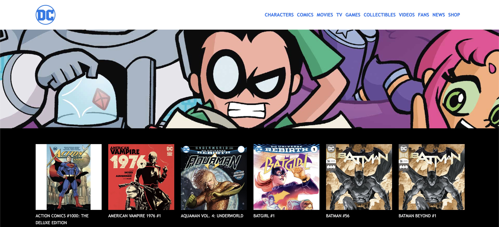
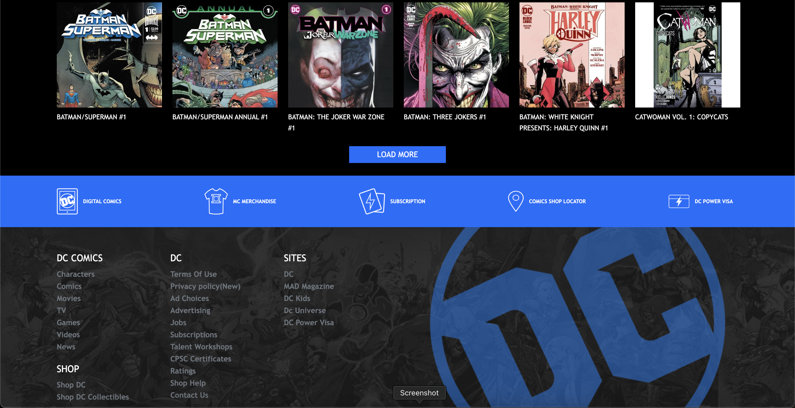
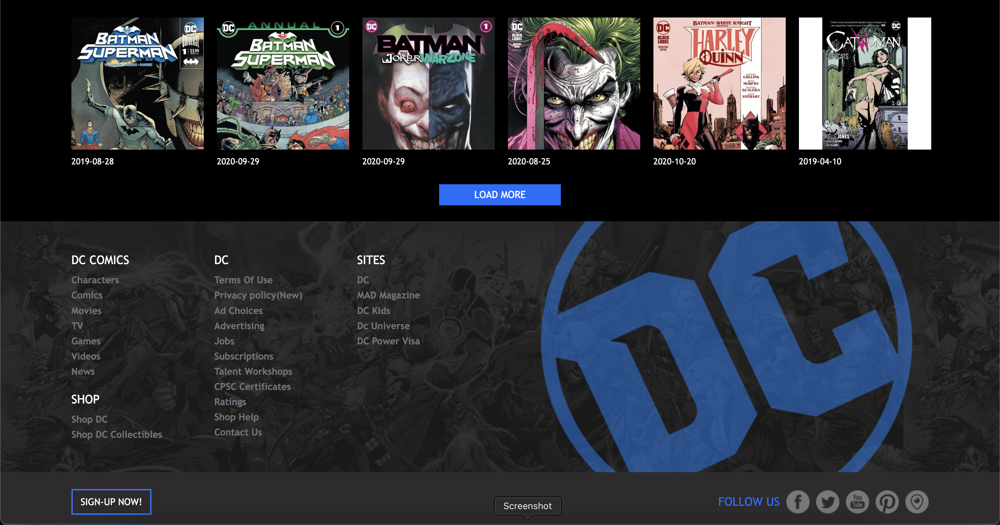

## LARAVEL COMICS

## consegna:

Creiamo un nuovo progetto Laravel.

Concentriamoci sul layout: creiamo un file di layout in cui inserire la struttura comune di tutte le pagine del sito web (tag head, tag body, ...) eventualmente includendo header e footer tramite due partials.

Creiamo poi una rotta per visualizzare la lista di tutti i fumetti recuperati dal file comics.php che trovate in allegato, inserendoli nella cartella config e abbelliamo il tutto sfruttando SASS

## bonus1 -->

Creare più pagine istituzionali che condividono lo stesso layout

## bonus2 -->

Creare uno o più componenti da condividere tra le varie pagine

## Risultato finale

